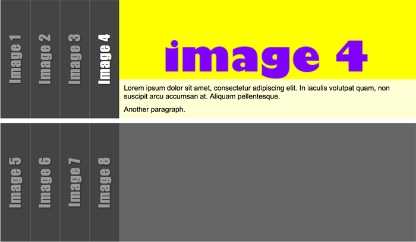

Slideshow with horizontal accordion-effect
===
##Working Demo
[Slideshow](http://vanjaswebb.se/incl/content/bth/javascript/me/playground/plugin/index.html).

##Description
Place your favourite images in this extensible slideshow-plugin, made in jQuery.

##Link source in header
Make sure the stylesheet and script source are linked correctly between &lt;head>&lt;/head>
Latest jQuery-script can be downloaded at <a href="http://jquery.com">jQuery.com</a>

<pre>
&lt;link rel="stylesheet" type="text/css" href="slideshow.css">
&lt;script src="jquery-1.11.0.js">&lt;/script>
&lt;script src="slideshow.js">&lt;/script>
</pre>
		
##Customize the content (HTML)

1. **Images** are placed in folder with the same name and linked into the html-code:
	<pre>&lt;img src="images/img1.jpg" /></pre> &nbsp;element tags.

2. **Headings** are written inside:
	<pre>&lt;p class='ss_heading ss_rotate'>Image 1&lt;/p></pre> &nbsp;element tags.
3. **Caption** text inside image is written inside tags: 
	<pre>&lt;div&nbsp;class='ss_caption'>&lt;p>A&nbsp;very&nbsp;small&nbsp;paragraph.&lt;/p>&lt;/div></pre>

4. A **new row** of images is created between ul tags: 
	<pre>
	&lt;ul&nbsp;class='ss_accordion'>
  		&lt;li>
    		&lt;img src="images/img1.jpg" />
   			&lt;p class='boxheading rotate'>Image 1&lt;/p>
    		&lt;div class='textbox'>
      			&lt;p>A very small paragraph.&lt;/p>
    		&lt;/div>
  		&lt;/li>
  		&lt;li>
    		&lt;img src="images/img2.jpg" /> 
    		  . . .
	&lt;/ul>
</pre>

##Customize the look (CSS)
Predefined size of images in this slideshow is: 500px (width) x 200px (height).
To change size of the images, see instructions in slideshow/slideshow.css. You only have to do this if the images differ from the predefined default image size.

Read more in downloaded index.html.

##Have fun!

Change Log
---
* v1.0    - 10 mars 2014 - First release
